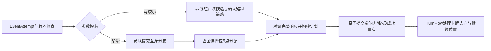

# 马歇尔计划与华沙条约

description：查询北约两个前置事件的国家筛选、马歇尔短缺项目解释、华沙互斥选择、影响力分配与成功事件记录。

状态：2026-10-05，两牌参数与流程设计；C#未实现。入口：[参数描述](../../Data/Descriptors/alliance-prerequisites.data.json) → [参数](../../Data/Cards/deluxe-2015/alliance-prerequisites.parameters.json) → [Schema](../Contracts/alliance-prerequisites.schema.json)。本批复用[影响力模块](../Descriptors/influence-events.module.json)与[条约前置账本](treaty-protection.md)，不新建逐卡UI规则。

## 印刷效果与归属

| 卡牌 | 选择拥有者 | 基础效果 |
|---|---|---|
| #23 马歇尔计划 | US | 七个不同且非苏联控制的西欧国家，各加1美国影响力；解锁北约 |
| #16 华沙条约成立 | USSR | 二选一：东欧四国移除全部美国影响力，或东欧放置总计5苏联影响力、每国最多2；解锁北约 |

核对[英文Deluxe卡图](https://www.gmtgames.com/nnts/TS_Cards_Deluxe.pdf) p4 #23、p3 #16；[R2015](https://www.gmtgames.com/nnts/TS_Rules-2015.pdf) §2.1.1–2、§2.1.7、§5.2、§6.1.1。FAQ v5 p2的马歇尔下划线勘误仅说明解锁北约是持久结果，不自动规定本批短缺策略。原卡图、整段卡文不进入仓库。

两张牌均为直接事件增加／移除，不使用印刷OPS预算、敌控加价、普通可达性或DEFCON地区限制。其他已知事件干预须单独验证，未知相关组合RequiresRuling。对手用OPS触发事件时仍由事件受益方选择；出牌者与PhasingPlayer保持既有编排身份。

## 马歇尔计划：非苏控西欧筛选

在EventAttempt开始时，从正式地图查询具有 `region.western_europe` 子区的国家，并用当前影响力和稳定度派生控制。允许美国控制和双方未控制，排除苏联控制；不能把“已有苏联影响力”当作苏联控制，也不能先加1打破控制再认定目标合法。

奥地利、芬兰同时属于东西欧，均可进入候选；加拿大、土耳其按规则西欧数据也可进入，不用现实地理或历史马歇尔受援国名单判断。苏联无影响力、美国无影响力均不是额外资格要求。

正常必须选7个不同合法国家，每国只加1。保留原有双方影响力，不能集中到一国、重复国家或少选。数量与每国增加量从参数查，稳定度和地区成员只从world.json查。

### 用户确认：AP1-RULING-01

用户于2026-10-05明确回复“采用该解释”：不足7个合法国家时选全部合法国家，各加1；零候选仍完成事件并解锁北约。参数为 `shortage_policy=SelectAllAvailable`、`zero_candidates_outcome=ResolvedNoChange`。

因此 `requiredCount=min(targetCount, legalCount)`；零候选不创建需要玩家提交空列表的无意义决策，由权威结算步骤完成无变化事件。该解释适用于本牌自身的非苏联控制筛选，不外推经互会不足4国，亦不授权额外活动效果把目标缩小时自动使用同一策略。查找未命中官方专门裁定不等于证明它不存在；采用依据是本次用户确认。

## 华沙条约：先选分支，再选目标

`ChooseOneInfluenceBranch`先创建拥有者为苏联的BranchDecision，只接受 `remove_us` 或 `add_ussr`。核心不替玩家选择更有利的分支。收到有效分支响应后保存branchId及新的DecisionRevision，再创建对应目标决策；选择阶段不能产生影响力或提前解锁北约。

### remove_us：东欧四国移除全部美国影响力

选4个不同东欧国家；每国美国影响力归零，苏联影响力保持原值。没有控制方限制，不按数量扣固定点，也不把四国误写为整个东欧。允许奥地利和芬兰；西德及仅因邻接东欧的国家不合法。

**AP1-INTERPRETATION-01：** 卡面未要求目标必须有美国影响力，因此设计采用AnyRegionCountry，允许选择美国影响力为0的国家，即使其他东欧国家有美国影响力也可不选它们。这是卡文与移除语义推导，未发现专门FAQ，不冒充用户专门确认。选择四个零量目标为ResolvedNoChange，仍是已发生的星号事件并解锁北约。

正式地图东欧国家数足以提供4个目标；不能根据“有美国影响力的国家不足4个”删减数量。若缺失国家或额外未知干预令目标不足，报资料错误／RequiresRuling，不自动套马歇尔或第二批移除的短缺解释。

### add_ussr：总计5点，每国最多2

只接受正整数的国家分配记录，国家ID去重、全部属于东欧；各国1至maxPerCountry，总和必须等于totalAmount。合法例子包括2+2+1、2+1+1+1和五国各1。允许美国控制国，不需要苏联当地或邻国已有影响力；不能复制马歇尔的非敌控筛选。

完整分配一次验证、生成计划并提交，金额来自受限输入而非UI自由写权威状态。不先加一部分再等待下一点，不混入remove_us的移除。正常地图可分配容量充足，未知限制不能静默减成不足5点。

## 复用对象与继续位置

| 计划对象／符号 | 职责 |
|---|---|
| InfluenceBranchRules.ValidateBranchAndBuildDecision | 校验可用分支及拥有者，生成分支后决策 |
| CountrySelectionRules.ValidateSelection | 去重、数量、区域和控制筛选；马歇尔需用完整合法集合派生短缺数量 |
| InfluenceMutation.BuildPlan | 每国固定增加或RemoveAll，不负责选择玩家或写卡牌去向 |
| 额度分配校验 | 正整数、总额、每国上限与名单，复用现有分配机制的结构校验 |
| EventFactLedger | 最终提交成功事件事实；判据引用条约数据的event_fact_policy |

这些均是计划接口，entrypoints为空，planned_entrypoints才列未来路径。新增分支帧保存EffectInstanceId、BranchId、SelectionKind、规则摘要、CommandId、DecisionId/Revision、ExpectedStateVersion及继续位置。UI可在提交前调整预览，已提交分支不能凭返回按钮改写权威帧；若要支持撤回，须另设并验证命令。

所有响应校验会话身份、拥有者、分支、版本和当前步骤。过期、错误拥有者、重复国家或不完整分配整条拒绝，无部分变化；先前已锁定的分支不被一个坏目标响应重置。保存并恢复后继续当前步骤，不重新询问已提交分支，不重复写成功记录。

## 成功事件与北约衔接

影响力变化、幂等收据与成功事件事实在同一最终事务提交。成功Changed／NoChange的判据只引用条约数据，不在本批复制北约的OR前置名单。马歇尔零候选与华沙四个零量目标按各自依据允许成功NoChange；开发Fault、未知干预、等待选择、被禁止和未触发事件均不写成功事实。

两张星号牌的实体移出由TurnFlow根据已发生事件及cards.json标记完成。事件成功后卡牌移出并不丢失前置事实；回合末不清除历史。北约仍须另行实际发生才有保护，本批成功不会自动激活北约或立即进行欧洲计分。

## 验证与下一步

[验收案例](../Design/alliance-prerequisites.cases.json)和[执行证据](../Design/alliance-prerequisites.validation.json)区分参数、离线参考模型与运行验收。C#事务、存档、身份、选择流程及头条／OPS顺序仍待实现。经互会短缺不受AP1-RULING-01授权。

后续已设计[戴高乐与勃兰特](nato-exceptions.md)的法国/西德影响力、VP、北约例外及取消关系；按小批推进，保持事件数据、对局状态、表现资源分离。

## 北约局部例外批（2026-10-05，待实现）

[戴高乐与勃兰特](nato-exceptions.md)复用固定影响力变更、永久活动实例及VP批次；取消只结束持续例外并登记未来阻止，不逆转历史收益，不删除北约。勃兰特唯一VP批次在卡文首步关闭，终局停止后续步骤。拆墙完整事件未绑定，不能以取消接缝代替其处理器。
