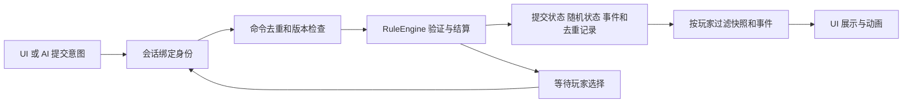

# 游戏架构与规则模块设计 v0.1

> description: 查找 ColdWarStruggle 的大模块、规则子模块、对象边界、命令流程、换画风方式和实施验收顺序。
> 状态：2026-09-18 设计草案；未实现游戏源码。本文确定结构与行为约束，不代表逐条规则或全部卡牌已完成设计。
> 输入：用户提供的 AGENTS.md，以及已确认的 Unity 6、URP、C#、Deluxe 基础规则、本地双人优先。

## 1. 六个大模块

| 模块 | 负责内容与子模块 | 输出与依赖 |
|---|---|---|
| Core | 领域状态、地图规则、行动规则、卡牌效果、选择、流程状态机、随机性、计分胜负 | 纯 C#，无 Unity 和网络依赖；输出领域结果 |
| Application | 会话身份、命令去重、版本检查、合法行动查询、玩家视角投影、回放编排 | 依赖 Core；为 UI、网络和 AI 提供同一入口 |
| Infrastructure | JSON 存档、数据加载、可信日志、配置 | 实现 Core/Application 定义的接口；不裁决规则 |
| Presentation | 地图视图、输入、UI、镜头、主题资源、动画、声音 | 依赖 Core/Application；只读取玩家视角和可见事件 |
| Networking | 后续权威服务器适配、消息传输、同步与重连 | 依赖 Core/Application；当前只设计边界 |
| AI | 后续合法行动策略、局面评估、搜索 | 依赖 Core/Application；正常 AI 无权读取对方秘密信息 |

Bootstrap 负责组装具体实现。Core 不调用外围层；程序集禁止循环依赖。Wiki 和测试属于跨模块工程支持，不是游戏运行时的第七个管理器。

## 2. Core 从大到小的拆分

| 子模块 | 对象或服务（拟定） | 独立职责 |
|---|---|---|
| 静态定义 | CountryDefinition、RegionDefinition、CardDefinition、RulesetDefinition | 稳定 ID、邻接图、地区归属、卡牌参数与版本化规则集 |
| 动态状态 | GameState、CountryState、PlayerState、DeckState、TurnState | 权威对局数据；不存 GameObject、镜头位置或翻译文字 |
| 开局与阶段 | SetupRules、TurnFlow | 初始配置、头条、行动轮和回合结束的状态转换 |
| 控制与影响力 | ControlRules、InfluenceRules | 控制判定、目标合法性、逐步花费与影响力变动 |
| 行动预算 | OperationsContext、OperationsRules | 预算来源、消耗、修正、剩余预算与使用范围 |
| 政变与调整 | CoupRules、RealignmentRules | 各自的目标、修正、随机结果及后续状态变化 |
| 风险与军事行动 | DefconRules、MilitaryOperationsRules | 地区限制、军事行动记录和相关结算 |
| 太空竞赛 | SpaceRaceRules | 尝试条件、结果、进度、奖励和阶段性能力 |
| 卡牌生命周期 | CardPlayRules、DeckRules | 出牌用途、事件与行动的次序、弃牌、移出和牌堆变化 |
| 卡牌事件 | ICardEffect、CardEffectRegistry | 按 EffectId 显式注册；一般效果组合，复杂事件独立实现 |
| 多步骤选择 | PendingDecision、DecisionResolver | 选择归属、可选目标、预算和可序列化的后续步骤 |
| 持续效果 | ActiveEffectState、EffectResolver | 适用范围、规则修正、到期条件和显式优先顺序 |
| 计分与终局 | RegionalScoringRules、VictoryRules | 地区结算、VP 变化和终局原因，不由 UI 推断 |
| 确定性支持 | IRandomProvider、StateValidator | 可持久化随机状态、不变量和稳定状态摘要 |

这些名称是实现接口的规划，不是现有代码索引。中国牌、计分牌等特殊行为进入明确的规则策略，不靠卡牌显示名称或散落的布尔分支处理。不要为每张卡牌建立一条深继承链。

## 3. 面向对象的具体边界

- 定义数据不可随对局改变；动态状态由权威核心持有，外部不能获得可修改的引用。
- CountryId、CardId、PlayerSide 等表达领域概念；本地化名字仅用于显示。
- RuleEngine 编排服务，不把全部计算堆进单个方法或 GameManager。
- 卡牌效果通过组合复用影响力变动、抽弃牌、计分、效果注册等能力；不能借用普通行动命令绕过事件自己的条件。
- 随机源、存档和会话入口使用接口；简单值对象和计算不为抽象而额外增加接口。
- 行动玩家、事件受益方、负责选择方和失败责任方分别记录；不能只靠一个 CurrentPlayer 推断。

## 4. 最小公共接口与数据流

Application 对外提供 IGameSession.SubmitAsync(command, cancellationToken)，并提供玩家视角查询及合法行动查询。会话绑定身份，不能信任客户端自报 PlayerId。

命令信封携带 CommandId、GameId、ExpectedStateVersion、类型和载荷。载荷只表达意图，如卡牌、国家、操作方式和选择；骰子、预算和最终影响力由核心计算。

Core 接收已经绑定的行动身份、权威状态和规则集，返回接受或拒绝、稳定错误码、领域事件及新状态版本。权威结果只在可信边界内流转；Application 投影后才向调用者返回 PlayerCommandResult 与 PlayerViewSnapshot，避免 CommandResult 直接泄露秘密事件。

同一身份、CommandId 且载荷相同的重试返回原结果，不再次执行；相同 ID 配不同载荷拒绝。先处理已完成命令的重试，再检查新命令的状态版本。

合法行动查询复用同一套验证规则，只给出当前玩家可知的候选操作，不泄露隐藏信息。查询不消耗随机数或推进状态。

## 5. 一次命令如何可靠完成

1. 验证会话、身份、对局、命令结构和重试记录。
2. 检查状态版本、当前阶段、待处理选择和行动资格。
3. 在隔离的工作状态中验证目标与预算，执行效果并产生事件；随机状态也只在工作副本推进。
4. 在规则规定的结算点检查胜负与后续流程。不能笼统把所有胜负检查拖到动画结束或整张卡牌结束。
5. 不变量通过后，一次性提交状态、随机状态、事件序列与去重结果。拒绝命令不产生部分修改。
6. 返回按玩家过滤的结果；动画可以跳过，逻辑已经完成或明确等待合法选择。

数据库事务后续由存储适配器承接；v1 不实现完整 Event Sourcing。取消请求不能撤销已经被权威核心接受的命令，客户端可凭同一 ID 查询或重试。

## 6. 多步骤事件与可恢复性

事件返回“完成”或“等待选择”。PendingDecision 保存 DecisionId、拥有者、来源、可见性、选择约束、剩余预算和结构化 ContinuationState。它不能持有协程、闭包或 UI 回调。

ResolveDecisionCommand 必须匹配当前 DecisionId 和负责选择的身份，并重新验证选择。等待期间只接受该状态允许的命令；重复回应不能触发两次后续效果。必须支持在选择中途保存、退出和恢复。

持续效果通过明确的规则挂钩影响目标、费用、修正或结算；先记录每类挂钩的优先顺序，再处理冲突，不依赖字典枚举顺序。

## 7. 隐藏信息、随机与存档

完整 GameState、手牌顺序、牌库和秘密选择仅在权威侧。快照、错误信息、合法目标、事件和普通回放均按玩家视角过滤。供调试的完整日志单独存放，不发给普通客户端。

随机算法版本和完整随机状态必须保存；只保存 seed 不足以恢复到中局。失败命令不推进随机序列；相同初始数据、规则版本、命令和随机状态应产生相同结果。

JSON 存档记录 SchemaVersion、RulesVersion、GameVersion、状态、持续效果、待选择、随机状态、去重结果和事件序号。未知版本明确拒绝；支持的旧版本通过具名迁移转换。不把 MonoBehaviour 序列化成正式存档。

回放从可信快照和命令记录重演并核对稳定摘要；观看方的回放只展示当时已经公开的信息。

## 8. 换画风的设计

ThemeDefinition 归 Presentation 管理，以 CountryId、CardId、事件类型映射模型、材质、图标、卡框、字体、音频和动画。MapLayout 保存国家 ID 对应的显示坐标和选取区域；规则邻接图留在 Core 数据中。

文明风格与写实风格共用玩家视角和命令入口，各自提供地图视图及主题资源。换主题可以影响渲染方式、资源成本和交互布局，但不能修改稳定 ID、邻接关系、规则预算或结算结果。地图从 2D 变 3D 可能需要新的视图实现，不承诺只换一张图片即可完成。

验收方式：同一对局记录在两套占位主题中播放，命令结果与权威状态摘要一致；跳过全部动画也不改变结果。

## 9. 实施顺序与验收门槛

| 阶段 | 最小可交付结果 | 必须验证 |
|---|---|---|
| 设计基线 | 模块依赖、规则来源、规则条目与测试矩阵 | 每条规则能追到来源；未知项明确标注 |
| 工程骨架 M0 | Core/Application 程序集和 EditMode 测试入口 | Core 无 Unity 引用；真实测试报告可读取 |
| 规则闭环 M1 | 授权会话下完成一次影响力操作 | 合法、非法、过期、重复命令与玩家视角 |
| 基础规则 M2 | 阶段、OPS、行动、风险、计分和胜负 | 边界值、责任玩家、结算顺序、终局截断 |
| 完整规则 M3 | 基础规则集地图、卡牌与可完成的本地双人对局 | 逐卡牌测试、交互裁定、中途存档与回放 |
| 表现与扩展 | 局部地图，再完整呈现、联网、AI | 换主题不改规则；客户端和 AI 不越权 |

优先的跨模块场景：对手事件与行动顺序；双方头条的秘密选择；多步骤事件恢复；中国牌状态变化；计分牌边界；DEFCON 相关失败责任；持续效果重叠；地区计分导致终局；非法操作后的随机状态不变；重复命令跨存档仍只结算一次。

## 10. 规则资料与下一步

规则研究入口：[GMT 官方 Deluxe 规则书](https://www.gmtgames.com/living_rules/TS_Rules_Deluxe.pdf)。以其编号建立追溯；文件标题、修订、获取日期和校验值需在资料冻结时记录，不能只凭 URL 认定永久不变。

本轮没有复制规则书、卡牌全文或美术。本文没有宣称全部卡牌规则已经设计完成。下一步按“开局与状态 → 阶段 → 行动 → 卡牌与效果 → 计分终局 → 逐卡牌交互”分别建立知识页；每页必须包含来源、前置条件、输入输出、流程、异常和验收案例。精确卡牌清单、对应勘误与争议裁定仍需逐项核实。

从 [Wiki 索引](index.md) 返回；工程约束见 [AGENTS.md](../../AGENTS.md)。
