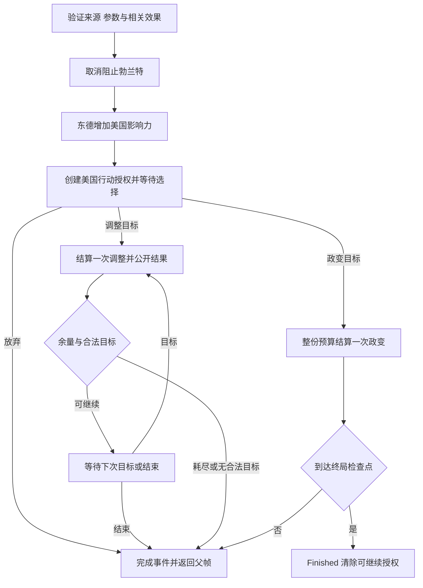

# 推倒这堵墙与事件行动授权

description：按CardId查完整拆墙步骤、来源OPS预算、美国选择、逐次调整、免费政变、DEFCON地区豁免、责任和可恢复子帧。

状态：2026-10-05，设计与静态参数已绑定；C#/Unity未实现。先读[数据描述](../../Data/Descriptors/event-operations-batch1.data.json)，再读[参数](../../Data/Cards/deluxe-2015/event-operations-batch1.parameters.json)、[Schema](../Contracts/event-operations-batch1.schema.json)和[模块描述](../Descriptors/event-operations.module.json)。组合步骤复用[composite-events](../Descriptors/composite-events.module.json)，不是独立逐牌算法。

## 已核实规则与设计选择

用户要求继续逐批设计全部规则、模块复用、共享参数与渐进式检索，仍不开始Unity/C#实现。本批补全#96，不新增可选牌或美术方案。比较了逐卡专用行动、把全部普通OPS权限开放给事件、携带具名能力的受限授权三种方案；采用第三种，底层仍调用普通政变/调整算法。它保留严格来源和地区边界，并可供后续明确授予行动的事件复用；不能凭相似卡文替其他牌授予相同能力。

重新目视[GMT英文卡图](https://www.gmtgames.com/nnts/TS_Cards_Deluxe.pdf) PDF p14 #96完整事件。核对[R2015](https://www.gmtgames.com/nnts/TS_Rules-2015.pdf) §4.5C、§5.2、§6.2–6.3、§7.4、§8.1、§8.2.5，以及[FAQ v5](https://www.gmtgames.com/nnts/FAQv5.pdf) PDF p16 #96和p20–21相容澄清；不采用旧版期末胜负说明。

步骤固定为：取消并阻止勃兰特 → 东德增加3美国影响力 → 美国可选欧洲免费政变或政局调整。取消目标和不撤销历史收益的政策从既有勃兰特参数解引用，不另写目标ID或复制取消政策。反向验证勃兰特取消来源确为本牌。OPS基值读取源牌的printed_ops，本牌印刷为3，不再在事件参数复制3 OPS。

直接增加的3影响力不受OPS修正、敌控加价、可达性或DEFCON地区限制影响。欧洲行动可以在全部主地区为region.europe的国家进行，包括西欧、东欧和加拿大；不局限东德。政变和调整仍要求目标存在苏联影响力，不要求美国在目标或邻国有影响力。国别、稳定度、战场与邻接只查正式规则图，不看画面位置。

## 服务与授权对象

| 计划对象/方法 | 职责与边界 |
|---|---|
| CompositeEventResolver.ResolveOrderedSteps | 固定收益、取消和行动授权按卡文顺序；收集不可变计划，保存继续位置 |
| EventPreventionService.CancelAndPrevent | 复用勃兰特取消关系，结束西德例外并登记永久阻止；不返还VP或影响力 |
| EventOperationsService.CreateGrant | 从注册步骤创建受限授权、独立预算和第一次选择；客户端不能调用它授予自己权限 |
| EventOperationsService.ResolveChoice / ResolveOne | 验证意图，调用标准CoupRules/RealignmentRules；逐次推进或结束子帧 |
| OpsModifierService.Quote | 读取来源卡基值，按US有效实例报价；固定影响力不进入此服务 |
| ActionRestrictionService / DefconService | 逐目标组合基础、条约、地理与已核实活动事件门禁；处理战场降级及责任信号 |
| MilitaryOperationsService / VictoryService | 免费政变信用查共享FreeCoup策略，核战走NuclearWarReached；不新增自动欧洲计分 |

以上均为计划接口，entrypoints为空。EventOperationsGrant包含GrantId、SourceCardId/EffectId、SourceResolutionId/StepId、RootActionId、ParentFrameId、PhasingPlayer、Actor、区域/模式能力、预算证据、规则/数据摘要。ID由权威命令与步骤确定性派生，授权只来自已注册处理器，不接受玩家的ignoreDefcon、预算、骰点或“取消已经发生”。引用和数据摘要变化需显式迁移，不能把过期授权转交另一帧。

OpsContext保存quote、效果实例/激活序列快照、mode、spent、按序目标历史、已结算尝试及下一决策。子帧保存ReturnPoint与StepCursor；PendingDecision保存Owner=US、FrameId、ContextId、DecisionRevision。状态只用稳定值和ID，不保存函数、Unity对象、动画回调或闭包。

## 预算、能力和行动模式

授权创建时，按US当前有效修正查询源牌OPS，并冻结本次预算证据。根出牌者是苏联时，也不能使用苏联的清洗或其他奖励替美国报价。遏制政策使本事件美国预算为4；美国受到清洗为2；同时遏制与清洗为3。普通上下限读取persistent_batch1的ops_policy，不在模块再写1/4。全欧洲目标不满足越南东南亚奖励；不是中国牌，不得借用中国牌奖励。已提交尝试不追溯重算，后续新增跨卡中断/重定价尚未核实则RequiresRuling。

首次选择合并模式与目标：Decline、Coup(CountryId)或Realignment(CountryId)。只有第一个合法尝试被接受时才锁定模式；非法目标不锁定、不扣预算、不消耗随机。Coup一次使用整份有效预算并结束授权，不能拆成多次政变。Realignment每次使用标准1 OPS；掷骰完成后重新选择目标，允许重复目标或换另一个欧洲国家，不能改为政变、影响力或太空。剩余OPS不并入根出牌OPS。

**EO1-INTERPRETATION-01：** 卡文may允许完全放弃可选行动；本设计还允许美国在任意已完成调整之间Finish，放弃余量。后者是may和逐次目标语义的推导，未找到专门回答“做了部分调整后结束”的官方FAQ，非用户专门确认裁定；仅适用于本授权，不新增通用跳过行动轮。若当前预算耗尽或确定没有合法目标，直接完成子帧；未知相关门禁不是“没有目标”，应暂停而非猜成自动结束。允许的核战自毁目标仍算合法，不强迫提前结束。

欧洲政变/调整只豁免DEFCON地理限制。战场政变无论成功失败仍按共享参数降级，免费政变不记军事行动；调整不降DEFCON、不记军事。免费不等于不限目标或忽略其他事件。所有具名门禁/掷骰修正须先识别；古巴导弹危机已由DC1核实；尚未设计的伊朗门等相关活动实例出现时RequiresRuling，不凭免费标记绕过。北约现有保护只阻止苏联的普通政变/调整，不阻止这次美国行动；本牌不是Brush War。

## 流程、事务与终局

首次启动命令先完成固定取消、固定影响力与授权创建，并一起提交至合法等待点；预检发现技术/规则数据错误则本次全部回滚。之后每次选择是独立权威命令事务。第二次选择失败不撤销先前固定收益或已经完成的掷骰。

政变顺序沿用已冻结基准：验证/已核实BeforeCoupAttempt → 免费信用查表（无军事增加）→ 读取骰子并处理影响力 → 战场DEFCON降级 → NuclearWarReached检查。本批不实现尚未核实的尝试拦截器。调整按US、USSR固定顺序取骰，只移除失败方现有影响力、不增加胜方影响力；平局仍花预算。下一次目标与邻接控制加成重查当前局面，不能缓存第一掷时的候选或控制权。

US为Actor/DecisionOwner，PhasingPlayer来自根行动；头条以打出本牌者为PhasingPlayer。DEFCON=2时美国选择欧洲战场政变是合法选择，但普通核战败者仍是该PhasingPlayer：苏联打出本牌则苏联输，美国打出则美国输。政变影响力与降级按同次事务提交；达到终局立即截断下一张头条、根OPS和其余行动，不因已有VP接近阈值另做计分。东德控制变化本身不触发欧洲控制胜利。

固定收益已提交但仍等待可选行动时，本牌留在InResolution。该时点的永久PreventionRecord可阻止勃兰特，但不冒称整个拆墙事件已完成；成功事件收据和星号去向由TurnFlow在子帧完成后处理。放弃可选行动不抹掉固定收益，本事件仍已发生。终局时仍记录已执行效果并关闭可继续决策/授权；真实牌区清理与根名额收尾属于运行验收。没有多打一张卡，没有额外普通行动轮；苏联用本牌OPS时保留原EventBeforeOps/OpsBeforeEvent次序，两份OPS预算互不混用。

若子帧到达核战终局，沿用组合事件的TerminalAtCheckpoint收尾：保存已执行步骤和事件已发生证据，按本牌星号处理去向并关闭继续位置；这属于同一终局事务的清理，不再执行剩余规则效果或另发玩家命令。不能把已发生的拆墙写成Suppressed/NotTriggered，也不能为“完成整张牌”继续父OPS或下一头条。此条是工程编排约定，真实实现仍由运行案例验收。

## 验收、来源和实现限制

[案例](../Design/event-operations-batch1.cases.json)分参数、固定前缀/授权投影、单次政变、逐次调整与运行层；[实际报告](../Design/event-operations-batch1.validation.json)只标注真实执行的离线检查。参考模型从正式地图计算邻接/控制和预算，并用指定骰子验证期望，不能证明真实鉴权、随机状态提交、幂等、存档或头条/OPS程序已实现。

本批使拆墙参数从Unresolved变为Bound；C#处理器仍planned，完整规则包仍不可开局。既有经互会短缺、同效果重复触发和未知跨卡交互继续RequiresRuling。本批未选择地图画风；Grant、事件与玩家快照均不引用视觉资源。下一批设计战争事件，复用影响力、军事和胜负服务。

[返回索引](index.md)

[DEFCON事件与政变干预](defcon-events-batch1.md)补齐危机实际Actor责任、任意边界解除、核潜艇/SALT政策与ABM视同OPS；全部仍planned。
