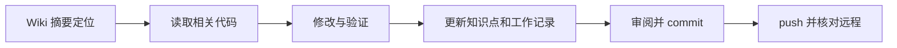

# Git 工作流与操作理由

> description: 理解本地仓库和 GitHub 的区别，查找提交、同步、Unity 忽略规则及当前恢复步骤。
> 状态（2026-09-18）：远程仓库已建立；文档通过网页登录提交。本地 E:\TwilightStruggle 尚未关联远程，未完成本地首次提交。

## 三个位置

工作目录保存正在编辑的文件；目录内的 .git 保存本地版本历史；GitHub 保存可同步的线上历史。连接插件不会自动创建本地关联，网页提交也不等于执行了本地 push。

- 本地项目：E:\TwilightStruggle。
- 远程仓库：https://github.com/joelchuh/coldwarheat ，由用户创建，当前为公开仓库。
- Unity 编辑器：E:\unity6.6，安装文件不属于项目源码。

## 常用命令及理由

| 命令 | 用途 |
|---|---|
| git status --short | 检查哪些文件被修改、哪些尚未跟踪 |
| git diff | 审阅尚未暂存的差异 |
| git add -- 文件路径 | 选择本次版本要保存的文件 |
| git diff --cached | 审阅即将提交的内容 |
| git commit -m 消息 | 在本地保存一个版本，离线也能进行 |
| git fetch origin | 下载远程历史，不替换工作文件 |
| git push | 上传本地提交 |
| git log -1 --oneline | 查看最近一笔提交及编号 |

commit 和 push 是两步；只有上传并核对成功，才能说已经同步 GitHub。

## Unity 文件取舍

跟踪 Assets 及其 .meta、Packages、ProjectSettings；忽略 Library、Temp、Logs、UserSettings 和构建输出。这样保留可重建工程所需的数据，同时避免缓存挤占仓库。大型美术资源加入前再评估 Git LFS。

.gitattributes 统一文本换行并标识二进制文件，减少无意义差异。不把令牌、密码、私钥或个人环境文件放进仓库。

## 每次工作的闭环

先查 Docs/Wiki/index.md，再查对应知识点和相关函数。完成修改后，运行相关验证，更新 Wiki 的代码符号、流程和测试入口，并在 Docs/Worklogs 保存真实结果。随后审阅差异、提交、同步。不覆盖用户已有修改，不强制推送。



## 当前本地恢复事项

本地 .git 已初始化，但目录授权后执行环境出现 setup refresh 错误，Git 配置、首次提交及远程关联尚未成功。线上已通过网页保存提交。本地原文件保留，不能报告本地已经推送成功。

恢复执行环境后，先检查本地文件和历史，为现有文件保留副本，再核对与线上差异。若 origin 不存在，可设置：

```powershell
git remote add origin https://github.com/joelchuh/coldwarheat.git
git fetch origin
```

origin 是远程地址的惯用别名。若已存在，先检查地址；不要重复添加或盲目修改。当前本地存在未跟踪文件且线上已有历史，不能直接覆盖目录、强推或机械套用空仓库的首次上传命令。接入远程 main 历史时必须保留本地改动。

## 连接完成后的常规同步

提交者身份只配置在本项目，使用 joelchuh 和 GitHub 隐私邮箱，不改全局配置。接入线上历史后首次 push 可使用 git push -u origin main，-u 用于记录跟踪关系。网页、插件、命令行登录状态可能不同，身份验证由用户完成，不在聊天里收集令牌。

```powershell
git push
git status -sb
git log -1 --oneline
git ls-remote origin refs/heads/main
```

核对本地 HEAD 与远程 main 的提交编号一致，并单独检查工作区是否有未提交修改。失败时保留本地提交，明确报告尚未同步。
