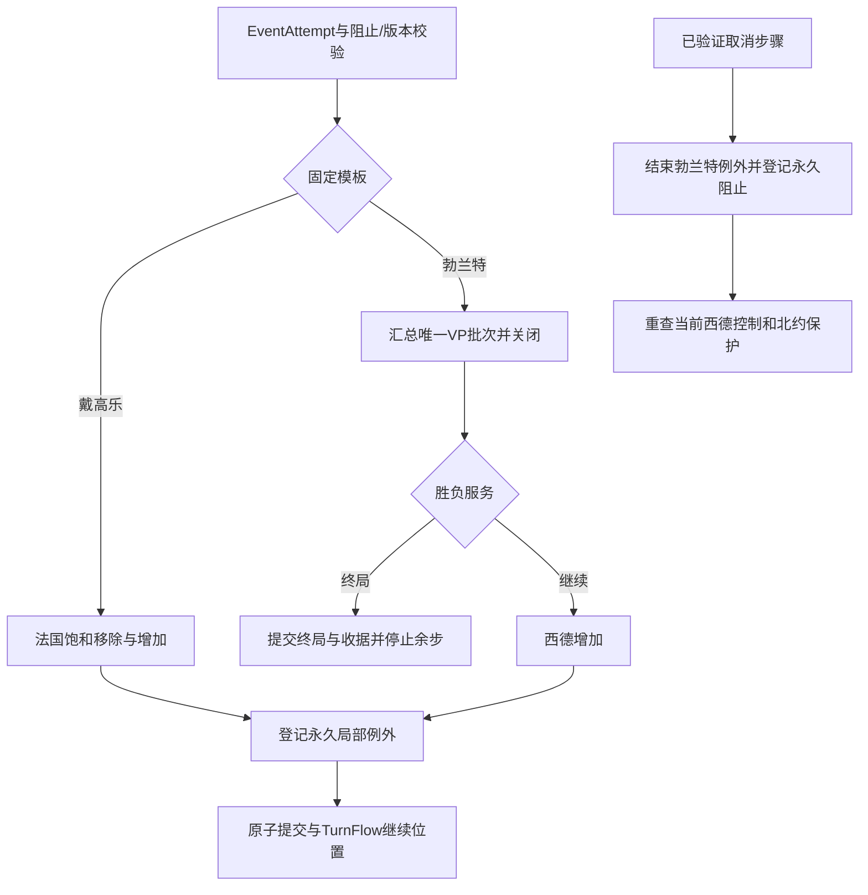

# 戴高乐、勃兰特与北约局部例外

description：查法国／西德固定影响力、勃兰特VP、组合步骤、永久国家例外、取消与未来事件阻止，以及终局继续点。

状态：2026-10-05，规则与数据契约设计；C#/Unity未实现。先读[数据描述](../../Data/Descriptors/nato-exceptions.data.json)，再按CardId读取[参数](../../Data/Cards/deluxe-2015/nato-exceptions.parameters.json)和[Schema](../Contracts/nato-exceptions.schema.json)。编排入口为[组合事件模块](../Descriptors/composite-events.module.json)，持续与禁止服务复用[active-effects](../Descriptors/active-effects.module.json)。

## 规则与来源

| 事件 | 固定步骤 | 持续部分 |
|---|---|---|
| #17 戴高乐领导法国 | 法国移除2美国影响力，再增加1苏联影响力 | 法国失去北约保护 |
| #55 勃兰特 | 苏联获得1VP，西德增加1苏联影响力 | 西德失去北约保护；拆墙取消／阻止本事件 |

已重新目视[GMT英文卡图](https://www.gmtgames.com/nnts/TS_Cards_Deluxe.pdf) p4 #17、p9 #55、p14 #96取消句；核对[R2015](https://www.gmtgames.com/nnts/TS_Rules-2015.pdf) §5.2、§6.1.1、§7.3/7.5、§10.2–10.3。两牌受益方固定USSR；对手触发不能将收益发给出牌者。没有可选国家或分支，不创建虚假的PendingDecision。

直接事件增减不消耗OPS、不套敌控加价、普通可达性、DEFCON地区限制或OPS加成。事件不要求北约已经发生；无北约时也执行收益并登记永久例外，之后北约激活时照常读取该状态。只有具体计分步骤可触发欧洲控制胜利，影响力变化本身不计欧洲胜利。

**NE-INTERPRETATION-01：** 法国不足2美国影响力时，RemoveUpTo取现有量，仍增加1苏联并登记例外；不生成负数，也不把缺额移至别国。这是固定目标移除语义及§5.2的推导，非专门FAQ或本次用户裁定；不外推其他卡牌的目标选择／短缺规则。

## 数据与对象边界

国家／例外映射仍只定义在条约参数的country_exceptions。本批nato_exception_ref引用该行，加载时要求while_effect_active等于本牌EffectId，再取得country_id；断指针、错版本、行换序导致指错效果均报错，不降级成默认国家。静态参数不含当前控制方、是否已取消或图像坐标。

| 计划对象／方法 | 职责 |
|---|---|
| CompositeEventResolver.ResolveOrderedSteps | 验证类型化步骤、维护游标／终局出口，汇集各模块结果 |
| InfluenceMutation.BuildPlan | 固定目标的饱和移除／直接增加，不改变VP和牌区 |
| ActiveEffectService.Activate / Cancel | 创建或结束永久局部例外，保留审计记录 |
| EventPreventionService.CheckCanTrigger | 从权威阻止记录／事件历史判断事件资格 |
| EventPreventionService.CancelAndPrevent | 按已核实来源取消目标持续部分并登记未来阻止 |
| 胜负服务的VpBatchClosed检查点 | 读取唯一VP批次，按共享符号方向和阈值判断终局 |

这些是计划接口，模块entrypoints为空。本页两牌固定步骤只允许RemoveUpToInfluence、AddInfluence、AwardVictoryPoints和ActivateNatoCountryException；不支持eval、函数名字符串或任意反射调用。编排层使用各服务的不可变计划统一提交，服务不相互持有可变GameState。

## 固定步骤与立即终局

戴高乐按参数顺序执行饱和移除、增加、例外登记，整项无选择事件作为一个权威命令事务提交。任何资料／未知干预／版本错误在提交前停止，不留下仅移除未增加的半成品。

勃兰特先汇总本事件所有双方VP。当前已核对参数只有一笔苏联奖分，方向和胜利阈值从victory数据取得，不能在卡牌处理器另写20或误记US正分。关闭该唯一VP批次并调用VpBatchClosed；未终局才继续西德增加和例外登记。

**NE-INTERPRETATION-02：** 唯一VP批次按卡文首步关闭，若达到自动胜利即不执行后续无关步骤，是卡文顺序与§10.3.1的编排推导，未找到专门针对本牌的FAQ。若将来注册了本事件额外双方奖分，必须先汇总全部该批次奖分，不能沿用“首笔加分就判胜”。未知奖分提供者必须在提交前停止。

例如SignedVp=-19时本牌使其到-20：提交苏联胜利及奖分收据，西德影响力／例外不再执行。这是合法终局截断，与数据错误导致整条拒绝不同。TurnFlow保存TerminalAtCheckpoint及已执行步骤摘要，不再执行剩余对手事件、OPS、选择或行动名额。终局快照不保留一个仍可继续的PendingDecision；卡牌事件已发生的事实及去向按TurnFlow星号策略处理，不把终局误写成Suppressed。该运行清理仍待C#验收。

## 取消、阻止与历史收益

勃兰特的取消来源ID只通过条约interaction_boundaries引用。来源牌完整参数已在[事件行动授权](event-operations.md)绑定，运行处理器仍planned；本批只设计其可生成的、已验证的内部取消意图。正式包不得仅有本接缝就把拆墙当作已实现。客户端不能提交“某事件已经发生”或“取消目标是这张牌”。

取消意图保存sourceCardId/sourceEffectId、sourceResolutionId、sourceStepId、targetCardId/EffectId、权威序列、规则／数据版本。CancelAndPrevent要求来源与引用关系匹配且调用者来自注册的权威结算步骤：结束当前勃兰特活动实例，生成永久PreventionRecord；没有活动实例仍登记未来阻止。相同命令／步骤重试返回原收据，同ID不同载荷为冲突。不要由UI返回按钮或客户端自报卡牌区域生成此意图。

持续例外被取消**不撤销**先前1VP或苏联影响力，不恢复原影响力快照、不重新计分、不删除北约，也不影响法国戴高乐实例。局部保护是否恢复仍取决于北约活动且西德当前由美国控制；西德不受美国控制时，解除例外也不会凭空得到保护。这一动态投影沿用TP-INTERPRETATION-01，不冒充专门FAQ。

CheckCanTrigger接受可信PreventionRecord和已提交事件事实。来源事件成功事实的判据引用条约event_fact_policy；OPS出牌、太空、弃牌或牌位Removed都不能代替成功事件。已提交的取消步骤可先产生PreventionRecord，即使来源事件后续仍在等选择，也不须等待整张来源事件完成才能保护一致性；未知历史不能推断为“从未发生”。有可信阳性阻止证据即可禁止，无阻止证据但历史不完整为RequiresRuling。

主动声明已禁用事件在合法动作／命令验证时拒绝；对手OPS触发或先前合法保留的头条在EventAttempt时发现已禁止，则Suppressed且不加VP、不加影响力、不激活例外，按既有帧继续OPS及牌区处理。不能把“取消已有持续状态”与“本次未发生事件”混成同一种牌区结算。禁用事件仍可用于合法OPS，依据§7.5。

## 生命周期、存档与表现

两个局部例外及PreventionRecord跨回合保留，ExpireAndReset不清除；活动实例以UntilCancelledOrGameEnd且expiry_boundary=null表达。戴高乐本批没有获授权的游戏内取消来源，不提供任意玩家取消。其他结算ID重复激活同效果暂为RequiresRuling，不自动重复奖励或刷新。

存档保存组合帧sourceResolutionId、下一步游标、VP BatchId及Closed标志、CheckPoint结果、活动实例、PreventionRecord、原始收据、版本／摘要。恢复后从已提交位置继续，不重记VP、不凭牌区重建活动效果。不同状态版本或已终局命令由既有边界拒绝；本批离线投影不能证明真实事务、幂等和存档实现。

北约仍从当前国家控制与活动例外查询行动限制。已知例外类型不修改OPS；未知相关活动类型RequiresRuling。UI只显示国家ID、收益／例外／取消事件及原因，可更换写实或文明风格资源，不参与资格、奖分或状态裁决。

## 验收与后续

[案例](../Design/nato-exceptions.cases.json)与[执行证据](../Design/nato-exceptions.validation.json)区分参数、离线参考投影和运行验收。C#/Unity事务、完整头条／OPS、存档、身份和真实取消来源处理器仍未运行；两张牌参数绑定不解除这些门禁。经互会短缺及旧重复激活边界保持原状态。

后续[拆墙完整设计](event-operations.md)已建立影响力、可选行动、OPS修正、DEFCON／条约限制和军事信用；接下来逐批补战争和其他复杂事件。

## 拆墙与事件行动授权（2026-10-05，待实现）

见[事件行动授权](event-operations.md)：强制取消/固定收益先提交至可选行动等待点；额外行动采用单独预算，US为Actor，原PhasingPlayer承担普通核战责任。欧洲政变/调整豁免只覆盖DEFCON地理门禁；战场降级、其他事件拦截与终局仍生效。免费政变不计军事；每次调整后重查局面，余量不可转成投放、太空、政变或根OPS。

最新交互见[战争牌持续与取消](war-card-hooks.md)：实际CardPlayer决定处罚资格；Flower精确时机/UN边界待裁定，戴维营与邪恶帝国完整步骤已绑定，处理器仍planned。
