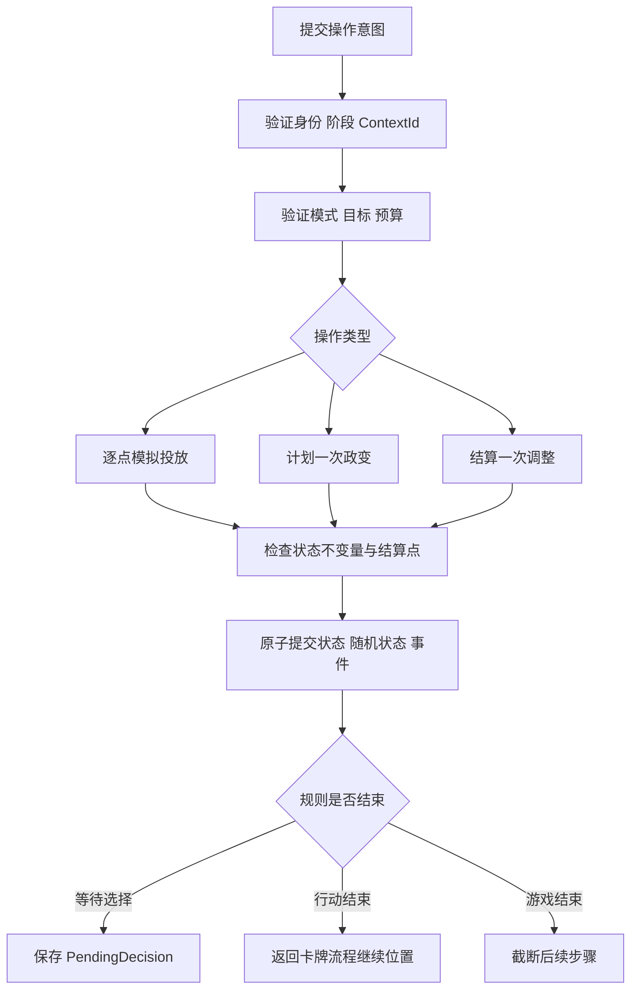

# 普通行动规则与对象契约 v0.2

> description: 查找影响力投放、政变、政局调整的计算边界、OPS 上下文、命令流程及验收案例。
> 状态：2026-09-19 设计稿；没有对应 C# 实现，没有已执行的规则测试。
> 范围：普通行动基础路径。卡牌例外通过显式规则上下文接入；完整事件交互、DEFCON 地区表与终局时序仍待细化。
> 来源登记：[rules-sources.md](rules-sources.md)。对象边界遵循 [architecture.md](architecture.md)。

## 1. 已核对的基础规则摘要

以下是算法定位摘要，具体规则参见对应资料章节；不替代原规则书。

| RuleId | 判定或计算 | 来源 |
|---|---|---|
| OPS-01 | 一次普通 OPS 用途选定后，不混用不同操作类型 | R2015 §6.0 |
| INF-01 | 控制：己方影响力减对方影响力 ≥ 稳定度 | R2015 §2.1.7 |
| INF-02 | 投放可达性依据行动轮开始时己方影响力及相邻国家；己方超级大国邻国亦可 | R2015 §6.1.1、6.1.4 |
| INF-03 | 每点投放费用：敌控为 2，否则为 1；每点后重新判定控制 | R2015 §6.1.2 |
| COUP-01 | 结果差值 = 骰子 + 有效 OPS − 2×稳定度；正值先移除敌方影响力，余量增加己方 | R2015 §6.3.2 |
| COUP-02 | 普通政变记录军事行动；战场国政变尝试降低 DEFCON，与成功与否无关 | R2015 §6.3.3–4 |
| REAL-01 | 每次调整花 1 OPS；双方掷骰。相邻控制国、当地影响力较多、超级大国邻接各提供对应加成；高者移除低者影响力，数量为差值，平局无变化 | R2015 §6.2.2–3 |

来源：[R2015 官方规则书](https://www.gmtgames.com/nnts/TS_Rules-2015.pdf)。

补充裁定：普通政变消耗整份 OPS，不能拆成多次政变；政局调整目标须有敌方影响力。事件授予的特定地区免费行动可能豁免 DEFCON 地区限制，但不自动豁免战场降级；免费政变不增加军事行动。修改后的 OPS 也影响普通政变的军事行动记账。参见 [F2010 FAQ，PDF 第 6、19–21 页](https://www.gmtgames.com/nnts/FAQv5.pdf)，本轮仅采用这些与 R2015 对应章节一致的说明。

## 2. 必须分开的对象

以下字段与符号均为拟定接口，具体文件尚不存在。

| 对象 | 保存内容 | 为什么独立 |
|---|---|---|
| ActionRoundContext | 行动轮 ID、PhasingPlayer、开始时影响力快照 | 中途选择或对手事件不能意外重置行动轮身份 |
| OperationsContext | ContextId、Actor、来源、模式、预算、已花费、限制与快照引用 | 同一行动轮可能包含由事件授予其他玩家的行动 |
| OperationsBudget | 印刷 OPS、一般修正、条件性奖励、已用预算 | 不把地区奖励永久写回卡牌定义 |
| ActionRestrictions | 行动种类、地区限制、目标限制、允许的明确豁免 | “忽略 DEFCON 地区限制”不是“忽略所有限制” |
| CountryDefinition | 稳定度、邻接 ID、地区标签、战场属性 | 静态规则资料可与显示资源分别加载 |
| CountryState | 双方当前影响力 | 不存容易与数值失去同步的可修改控制标记 |
| ResolutionContext | Actor、PhasingPlayer、来源卡、效果步骤、责任语义 | 避免把实际操作者等同于终局责任玩家 |
| OperationsProgress | 待选择 ID、剩余预算、已结算步骤、继续位置 | 存档恢复后能够继续，不重掷已完成骰子 |

快照是权威状态的一部分，而不是 UI 缓存。事件新增行动的可达性基准应由该事件的裁定指定；在逐卡核实前，不假定所有事件都等同于普通行动轮开始。

## 3. 输入、输出和错误

玩家提交意图：

- 影响力：OperationsContextId、按顺序排列的目标 CountryId 列表；每个元素表示一点，重复 ID 合法。
- 政变：OperationsContextId、目标 CountryId；不允许玩家提交骰点、差值或军事行动奖励。
- 政局调整：OperationsContextId、一个目标 CountryId；每次只结算当前选择，结果公开后再选择下一次目标。
- 继续选择：DecisionId 与所选选项。明确结束选择是否可用由该规则上下文决定，不提供通用“跳过行动”。

核心返回拟定的 OperationsResolution：状态变化、消耗明细、领域事件，以及 Completed / AwaitingDecision / GameEnded 之一。完整对象留在权威侧，再由 Application 过滤成玩家可见结果。

稳定错误分类：WrongPhase、WrongActor、StaleContext、ModeMismatch、UnknownCountry、IllegalTarget、InsufficientBudget、DecisionMismatch、GameAlreadyEnded。错误不能包含不属于请求者的信息；客户端显示文字与这些代码分离。

失败必须发生在正式提交前。目标存在不等于目标合法；合法目标不等于预算足够；有足够预算也不等于卡牌事件允许此操作。

## 4. 影响力：按顺序计费，再原子提交

拟定入口：InfluenceRules.PlanPlacement(state, context, orderedTargets)。

1. 验证当前上下文、行动模式和请求者。
2. 建立隔离的工作状态；逐点检查国家、可达性和额外限制。
3. 对每一点使用工作状态当前的控制关系报价，检查剩余预算后更新工作状态。
4. 记录逐点费用和前后影响力，验证总额、非负数和国家 ID。
5. 全部合法才提交这一个命令；否则丢弃整个计划，权威状态和预算不变。

同一份投放计划中，费用会随局面变化；可达性基准不会跟着新增影响力滚动扩张。若 UI 允许逐点确认，每个已接受命令都是已提交操作，后续失败不回退先前命令；若 UI 一次提交完整计划，则整批成功或整批失败。二者都不得允许修改已经提交的结果。

事件增减影响力另走 InfluenceMutation 原语，并附来源和事件条件。不要把事件包装成普通投放命令，否则会错误套用 OPS 费用和可达性规则。

## 5. 政变：一次目标，一份不可拆分的结算

拟定入口：CoupRules.Resolve(state, context, target, random)。

先由目标验证器检查敌方影响力、地区限制、活动效果和来源授予的权限；完整规则定义待下一批风险与效果条目补齐。任何未识别的效果或未完成的规则分支都应在开发测试中明确失败，不能默认放行。

预算计算返回 CoupStrength 与 MilitaryOperationsCredit 两个具名结果，避免把来源特殊奖励不加区分地传播给所有轨道。普通规则之外的具体值必须由已核对的卡牌策略提供。

结算管线保存计划中的骰子、影响力变化、军事行动、DEFCON 与胜负检查步骤。步骤按来源规则规定的时序执行；触发终局后截断后续步骤。本文不擅自决定所有卡牌共用一个副作用顺序，也不宣称免费行动免受活动事件影响。

在正式编程前，必须用规则案例锁定涉及即时终局的顺序。这是 CoupRules 完成的前置条件，不能留给动画或 UI 决定。

## 6. 政局调整：每次结果之后再选择

拟定入口：RealignmentRules.ResolveOne(state, context, target, random)。

验证当前目标后，基于当前局面计算双方修正，并以固定顺序从随机源读取双方骰子；随机读取顺序属于程序确定性约定，不改变双方掷骰规则。计算变化，更新预算，提交本次结果。

若仍可继续，生成新的 PendingDecision。下一次选择重新查询目标和修正；前一次结果可能改变控制关系或可选目标，不能在第一掷之前把全部后续目标与修正缓存死。

调整、政变与事件可以共用受控的影响力增减原语，但不共用“行动成功就添加影响力”的高层模板。各行动的算式及合法性保持在各自的规则类中。

## 7. 流程与复用边界

所有路径都复用验证器、状态事务、事件过滤和确定性随机接口。它们不依赖国家的画面坐标、材质、场景对象或动画完成回调，因此以后换画风不会改变这些规则。

## 8. 验收案例（设计，未执行）

下面使用虚构的国家 X/Y/Z 作为单元测试夹具，不代表正式地图数据。

| CaseId | 输入或触发 | 预期 |
|---|---|---|
| INF-A | X 稳定度 2，己 0 敌 2；预算 4，依次投放 X 三点 | 费用 2、1、1；最终己 3 敌 2 |
| INF-B | 只有 X 有己方影响力，邻接为 X—Y—Z；一次计划投放 Y、Z | Z 不因新投放的 Y 自动可达；整个计划拒绝 |
| INF-C | 合法计划前缀后跟未知国家 ID | 权威影响力与预算均不改变 |
| INF-D | 单点确认已提交，下一次命令非法 | 保留第一次结果，只拒绝第二次 |
| COUP-A | 有效 OPS 3，稳定度 2，骰 2，敌方影响力 1 | 差值 1；敌方降为 0，没有己方余量 |
| COUP-B | 普通战场政变计算差值不为正 | 仍进入风险与军事行动处理；具体终局顺序由后续规则案例锁定 |
| REAL-A | 双方修正后结果相等 | 消耗本次预算，影响力不变 |
| REAL-B | 第一次调整改变局面后再选择 | 根据新局面重新计算合法目标及修正 |
| SYS-A | 已接受的命令因网络重发而再次收到 | 返回原结果，不再次掷骰或扣预算 |
| SYS-B | 命令在验证阶段失败 | StateVersion、随机状态、事件序号均不推进 |
| SYS-C | 等待第二次选择时保存并载入 | 保留已结算结果、剩余预算和继续位置 |
| SYS-D | 查询合法目标或反复打开预览 | 不修改状态，不读取随机数 |
| SYS-E | 不属于 Actor 的玩家提交选择 | 拒绝且不泄露隐藏上下文 |
| SYS-F | 同一记录使用两套主题播放 | 权威结果和状态摘要一致 |
| SYS-G | 终局已经产生 | 后续操作不扣预算、不掷骰、不产生规则效果 |

INF-A/B、COUP-A/B、REAL-A 的基础期望依据本页规则摘要；其余是项目对一致性、身份与可恢复性的工程要求。以上均没有伪装成已通过的自动化测试。

## 9. 预定代码定位

| 预定文件路径（仓库相对） | 预定符号 | 实现前必须补齐 |
|---|---|---|
| Assets/Game/Core/Rules/ControlRules.cs | GetController | 定义数据校验 |
| Assets/Game/Core/Rules/InfluenceRules.cs | PlanPlacement | 事件可达性裁定 |
| Assets/Game/Core/Rules/OperationsRules.cs | BuildContext、QuoteBudget | 修正优先级与地区奖励 |
| Assets/Game/Core/Rules/CoupRules.cs | Resolve | DEFCON、军事行动、效果及终局顺序 |
| Assets/Game/Core/Rules/RealignmentRules.cs | ResolveOne | 活动效果、可结束选择的条件 |
| Assets/Game/Core/State/OperationsProgress.cs | OperationsProgress | 存档结构与继续位置 |
| Assets/Game/Tests/EditMode/OperationsRulesTests.cs | CaseId 对应测试 | M0 工程与真实测试入口 |

以上路径是规划，不生成不存在文件的链接。开始实现时先读对应小节，再用符号定位代码；实际命名变化需同步更新本表。

[返回索引](index.md)
