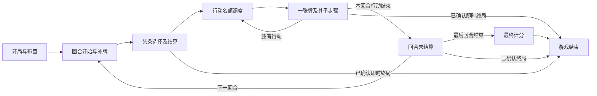

# 回合与出牌状态机设计 v0.2

> description: 查找阶段转换、头条保密、行动资格、事件与 OPS 次序、卡牌去向、等待选择及恢复规则。
> 状态：设计完成到本文声明的编排边界；尚无 C# 实现。逐卡事件、计分计算和完整数据集仍需后续完成。
> 模块摘要：[turn-flow.module.json](../Descriptors/turn-flow.module.json)；参数数据：[turn-flow.json](../../Data/Rulesets/deluxe-2015/turn-flow.json)；[验收案例](../Design/turn-flow.cases.json)。
> 本文中的类型、阶段和算法组织是项目工程设计；桌游依据使用 [R2015](https://www.gmtgames.com/nnts/TS_Rules-2015.pdf) 与经过版本筛选的 [F2010](https://www.gmtgames.com/nnts/FAQv5.pdf)，不复制卡牌正文。

## 1. 设计选择：外层阶段 + 内层结算栈

采用显式、可序列化的分层状态机。TurnFlow 管理阶段，CardPlayFlow 管理当前牌，EffectResolver 管理事件步骤；Application 串行接收命令并提交事务。界面只显示状态和提交意图。

不采用一个同时管理动画、回合和卡牌的大型 GameManager；也不把整个游戏写成可执行 JSON。JSON 保存经核对的参数、模块描述和设计案例，复杂行为由具名规则类实现。相较通用规则解释器，这种结构的修改范围和调试入口更清楚。

等待选择不是新的回合。FlowState 保留原阶段和步骤，只把执行状态改成 Waiting；玩家回应后回到原继续位置。

## 2. 状态与职责

| 规划对象 | 必需信息 | 职责 |
|---|---|---|
| TurnState | TurnNumber、Phase、Step、CompletedSlotsBySide、NextSide、EnteredEras | 外层流程位置；时代加入记录防止重复混牌 |
| ActionContext | ActionId、PhasingPlayer、SlotKind、起始影响力快照 | 当前行动的责任与可达性基准 |
| CardPlayContext | PlayId、CardId、PlayedBy、Mode、EventOrder、EventOutcome、Disposition | 一次出牌的用途、顺序、实际结果和去向 |
| ResolutionFrame | FrameId、ParentFrameId、HandlerId、Step、局部数据、ReturnPoint | 卡牌内再触发事件或出牌时，返回正确的上层位置 |
| DecisionGroup | GroupId、Policy、各方 DecisionId 与私有选择槽 | 支持头条并行提交；普通选择组仅一个决策 |
| PendingDecision | Owner、约束、可见性、FrameId、DecisionRevision | 谁可以回应、回应到哪一步 |
| VictoryContext | CheckpointKind、CandidateWinner、原因与责任上下文 | 区分立即终局、待审核胜利和最终计分 |
| FlowStatus | Active / Waiting / Faulted / Terminal | 区分正常等待、技术故障和游戏结束 |

PhasingPlayer、PlayedBy、EffectController 与 DecisionOwner 各自保存，不能都叫 CurrentPlayer。子事件改变选择方时，不随意改变父行动的责任身份；头条以当前结算的头条出牌者建立责任上下文。

GameState、随机状态、结算栈、待选择组、已接受命令的去重信息共同持久化。所有 CardId 和 HandlerId 都必须能在所用规则集解析。

## 3. 外层阶段与转移

阶段排列依据 R2015 §3、§4.5；下表的服务划分、继续位置和错误边界为本项目设计。表中数值读取共享参数，不在控制器再写一份。

| 阶段/步骤 | 接受什么 | 完成条件与下一步 |
|---|---|---|
| Setup.Validate | CreateGame 的完整规则集与种子 | 数据和处理器齐备后建立牌堆、轨道与初始布置上下文；缺失则拒绝创建 |
| Setup.InitialDeal | 内部发牌步骤 | 发到首个时代的目标手牌数，保留 InitialDealDone |
| Setup.Deploy | 当前布置方提交完整自由部署方案 | 按setup.deployment_stages依次执行固定布置及自由部署；此前已能看自己的手牌；完成后进入TurnStart |
| TurnStart | 内部步骤 | 按各自边界处理计数器与 DEFCON 恢复（军事累计已在期末评估后归零），再补牌，进入 Headline |
| Headline.Collect | 头条选择组的拥有者 | 收齐且锁定合法选择后统一揭示；特殊能力改变选择策略 |
| Headline.Resolve | 当前事件需要的选择 | 顺序结算并处理每张牌的去向；无未完成帧后进入 Actions |
| Actions.OpenSlot | 内部调度 | 根据当前资格建立 ActionContext，等待出牌或规则允许的跳过 |
| Actions.Resolve | 出牌/当前待选择回应 | 根出牌及全部子帧完成后，消耗当前行动名额，调度下一名额 |
| TurnEnd | 内部步骤及合法的回合末选择 | 执行本页第 7 节步骤；非末回合进入下个 TurnStart，末回合进入 FinalScoring |
| FinalScoring | 内部计分服务 | 按最终计分模式结算后给出唯一结果，进入 Finished |
| Finished | 查询、保存、查看记录 | 吸收态，不再接受改变规则状态的命令 |

Setup 和 TurnStart 使用同一补牌函数。首回合目标已满足时补牌数量为零，不能因两个阶段都有 Deal 就再发一手。牌堆不足时先处理当前牌堆，再由 DeckRules 在规则允许的边界洗入弃牌；被移出的牌和正在结算的牌不能进入洗牌输入。时代牌只在明确的跨时代边界加入，不能在回合末与回合初各加入一次。依据 R2015 §4.3–4.4。



图为正常路径概览；任何实际产生终局的规则步骤均可进入 Finished，不能为了走完箭头继续执行。

## 4. 头条：同时选择不等于同时执行

基本选择与排序依据 R2015 §4.5C；特殊太空能力见 §6.4.4。执行过程如下：

1. HeadlineRules 根据当前能力生成 SimultaneousSecret 或 OpponentRevealsFirst 选择组。后者只影响选择与揭示过程，不自动改变事件排序。
2. SubmitHeadline 验证本人的卡牌与头条资格，将牌转入本人的秘密 HeadlineReserved 区域。未达到揭示条件前，事件、错误和快照均不包含对方 CardId 或头条数值。
3. UI 可以先修改本地草稿；提交成功即锁定。断线和重试不会重新开放已经锁定的选择。此锁定方式是电脑端输入约定。
4. 普通模式收齐后一次性揭示。排序使用头条值策略及平手规则，写入可恢复的结算队列。
5. 头条只进入事件路径；牌面的 OPS 不自动赠送行动预算，事件明确授予的操作另建子帧。每个事件实际开始时重新检查其条件及拦截规则。先结算的事件可能改变后一事件的可用性，不能在揭示时预先把所有效果算完。
6. 一张头条包括其子事件、选择与最终去向处理完成，才处理下一张。终局则立即截断队列。

Application 仍串行接受命令。两方同时基于同一 ExpectedStateVersion 提交时，后处理的过期命令不消费卡牌；客户端刷新后以新 CommandId 重交同一个本地意图。失败回应不能暴露对方选牌。不要为了方便并发而绕过既有版本检查。

本地共屏双人需要 Presentation 提供交接和遮挡手牌界面。Core 负责玩家视角过滤，不声称能阻止同一设备的使用者读取磁盘上的权威调试存档。

## 5. 行动名额与一张牌的内层流程

普通名额依据参数中的 era_bands 和 normal_first_side 调度。每方已完成名额单独记录；额外行动由 ActionEligibility 提供带来源的授权，不能在回合开始就把整回合队列永久缓存，因为能力可能中途获得或失去。

普通情况下没有任意弃牌或跳过按钮。只有明确规则分支才提供跳过，例如无普通手牌且不选择可用中国牌。中国牌不因无牌而被强迫使用；单纯“查询不到合法动作”不构成跳过依据，可能是陷阱事件、强制出牌或处理器缺失。依据 R2015 §5.1、§9.8。

内层路径为：

```text
ValidateIntent → CommitPlay → BuildPlan
  → [EventAttempt 或 Operations 或 SpaceAttempt 或 Scoring]
  → [剩余步骤；可以等待选择或进入子出牌]
  → FinalizeDisposition → CompleteRootSlot
```

- ValidateIntent 检查阶段、身份、持有权、用途、卡牌限制和待选择状态，不消耗随机数。
- CommitPlay 为普通牌建立唯一 InResolution 位置并冻结本次意图。中国牌使用独立的转交策略，不复制成第二张牌。
- 使用对手阵营牌做普通 OPS 时，由行动方选择事件与 OPS 的先后；按照 R2015 §5.2 建立有序步骤。
- 事件条件在 EventAttempt 到达时判断；有效 OPS 在 Operations 开始时计算，纳入前序事件带来的修正。不得将选牌时的报价当成最终预算。
- 普通直接事件用途遵守阵营与卡牌限制；头条和事件授权的出牌由各自用途策略判定。计分牌没有可花费 OPS，头条比较值与 OPS 预算不是同一字段。
- 事件可以压入子出牌帧；只有根行动完成才计一次名额，子帧结束返回父帧，不能把对手选择误认为对手开始了下一轮。
- 卡牌效果不是自由组合的两条并行任务。事件、OPS 和所有决策必须按既定顺序推进。

陷阱、强制出牌、额外行动、头条取消等通过具名策略接入。未实现的效果 ID 使当前事务失败并进入可诊断的 Faulted 状态，不能当作无效果事件悄悄跳过。代码缺失属于开发故障，不判任何玩家输赢。技术故障回滚当前事务的规则变更，由会话另记 Faulted 诊断；它不同于玩家非法命令，也不允许保存半完成的规则变更。

## 6. 卡牌位置与结算结果

DeckState 对普通牌只允许一个物理区域：DrawPile、Hand、HeadlineReserved、InResolution、DiscardPile 或 Removed。未来年代的牌在 EraReserve 中，进入本局牌堆后才改变区域。

CardPlayContext 中区分 NotTriggered、BlockedPrerequisite、Suppressed、ResolvedNoChange、ResolvedChanged。Cancelled 的去向须由具体取消策略规定，不能与“未满足条件”混为一谈。核心依据为 R2015 §2.2、§5.2、§5.4、§6.4.5、§7.3、§9。

| 结算类别 | 去向策略 |
|---|---|
| 普通牌事件确实发生 | 按移出标记决定 Removed 或 DiscardPile；没有数值变化仍可能算发生 |
| 前置条件不满足或事件被禁止 | 不因移出标记自动移出；记录具体未发生原因 |
| 只使用 OPS、普通太空用途、被要求弃牌 | 按各用途规则处理；不得顺便触发被跳过的事件 |
| 持续效果 | ActiveEffectState 与实体卡牌去向分开，效果图标只是引用，不能让同一张牌同时处在两个区域 |
| 中国牌 | 独立 ChinaState 保存持有者和可用面；正常打出时即按 §9.3 转交，结算帧仅保留引用，事件转交按事件条款处理 |

一张普通牌的全部结算结束后才执行 FinalizeDisposition；特殊效果如要求更早移动，必须显式更新位置并让 Finalize 幂等跳过已完成的移动。每张头条分别完成此步骤，因此前一张已完成牌与仍在执行的牌可以被牌堆查询正确区分。

中国牌额外校验头条禁用、事件强制弃置禁用及不能妨碍计分牌使用的条件。它不进入普通牌库、手牌补足计数、弃牌堆或移出堆。不能用普通 CardDisposition.Discard 处理中国牌。

## 7. 回合末：按步骤运行，胜利不能统一立即检查

内部步骤及继续位置：

```text
MilitaryAssessmentAndReset
→ HeldScoringAudit
→ ConfirmDeferredVictory
→ ChinaReady
→ EndTurnChoices
→ ExpireAndReset
→ [EnterNextEra + AdvanceTurn | FinalScoring]
```

MilitaryAssessmentAndReset 交给军事行动规则一次性返回双方净结算，不先让一方到达胜利线再计算另一方。由此产生的胜利只存 CandidateWinner。评估快照、净分、军事归零与游标一起提交。HeldScoringAudit 后才由 VictoryService 按选定版本确认结果；各责任服务见 [风险与胜负设计](risk-victory.md)。

**版本冲突 CF-001：** F2010 PDF 第 21 页允许军事行动胜利截断扣留牌检查；R2015 §10.3.1 明文规定例外，军事行动达到胜利线后仍须检查获胜方是否扣留计分牌。采用 R2015，排除旧答案。不能把这处处理简化成通用 CheckVictoryImmediately。

本地普通模式在权威侧进行扣留计分牌检查，不公开双方完整剩余手牌。此为数字端保密实现，未启用锦标赛的全手牌展示；违规及胜负依据规则审计。计分牌被合法事件弃置与“留到检查时”分别处理；不要把剩余行动数不足的预警当成所有情形一律禁出牌，事件可能改变手牌。

EndTurnChoices 处理已获得且仍有效的回合末能力。F2010 PDF 第 20–21 页说明太空弃牌发生在扣留计分牌检查之后，不能借它补救该违规。持续效果按自己的 ExpiryBoundary 到期；计数器重置不能顺手清掉跨回合效果；军事累计归零已在 MilitaryAssessmentAndReset 完成，此处不再次评估罚分。

跨时代加入与 AdvanceTurn 属于一个有保存位置的转换；末回合不建立不存在的下一回合。FinalScoring 使用单独的胜负检查模式，不能按普通加分逐地区触发分数线胜利（R2015 §10.3.2）；欧洲控制等规则由计分服务显式报告。

**裁定边界：** 普通双方扣留已按 CF-002 确认 US 胜；双方扣留且 USSR 为军事候选赢家同样判 US 胜。双方扣留且US为军事候选赢家的CF-003已获用户确认：新版条款优先，判USSR胜。完整矩阵与案例见 [风险与胜负设计](risk-victory.md)。逐卡回合末效果优先级仍须按来源确定，不能靠字典枚举顺序。

## 8. 事务、恢复与隐藏信息

每个被接受的命令在工作副本上推进至下一个合法等待点、稳定阶段边界或终局，然后原子提交状态、随机状态、事件序号及去重结果。等待点之前已提交的步骤不因后续命令失败而回滚。不能持久化闭包、协程或 UI 回调作为继续位置。

没有输入需求的连续内部步骤尽量在同一事务完成。确需分段时，保存 Step 与已完成游标，并以内部转换 ID 去重，防止读档重复发牌、加分、混牌或完成行动名额。内部推进不是任意玩家可调用的 SkipPhase 命令。

普通选择组只有一个 Owner；头条是有独立私有槽的组合选择。存档恢复必须重建同一组及 FrameId，不重抽、不重掷，不重新计算已接受选择。新的选择按恢复时的合法上下文验证。

核心不变量：

- 非终局状态中的每张实体卡只在一个区域；结算引用不算第二个实体。
- 有未完成根帧或强制选择时，不切换行动名额。
- 非法命令不改变牌区、名额、随机状态和事件序号。
- 玩家可见快照、错误、查询和回放不包含另一方的秘密头条或未公开手牌。
- Terminal 不继续正常流程；Faulted 保留可诊断现场且不伪装成玩家失败。
- 规则集、参数数据摘要、随机算法与状态、帧结构版本随存档保存；不兼容版本拒绝加载。
- 动画完成、跳过动画或换主题均不推进规则阶段。

## 9. 模块接口、数据与验收

拟定接口见模块 JSON 的 planned_entrypoints；entrypoints 为空，表示还不能调用。职责分别是 TurnFlow.AdvanceUntilYield、HeadlineRules.BuildDecisionGroup、ActionEligibility.GetNextSlot、CardPlayRules.BuildResolutionPlan、CardDispositionRules.Finalize 与 DecisionResolver.Resolve。

参数数据只覆盖本模块已核对的基础时段、头条排序；回合初 DEFCON 参数已移到独立 defcon.json；不是完整可开局规则集。正式国家、卡牌与初始布置仍未生成；太空轨道和地区计分参数已建立独立数据子集，尚不足以初始化完整对局。本轮没有为了填满字典编造卡牌数值。

验收案例存储在单独 JSON，通过 CaseId 与 coverage 标签检索；状态均为 planned，不能当成已通过的游戏测试。案例覆盖普通转移、终局例外、嵌套事件、牌区、秘密信息、重复命令与读档。开发前完成剩余裁定并建立 M0 测试工程，再把案例逐个转成自动化测试。

[返回索引](index.md)

## 地区计分与太空竞赛衔接（2026-09-22）

- TurnStart在头条前按TurnNumber重置普通太空尝试次数一次；不因获得能力重置。
- HeadlineCollect建立选择组时查询SpaceAbilityRules；先看对方头条的能力只影响选牌可见性，原排序算法保持适用。
- ActionEligibility在每个新名额前查询太空能力。格8提供总额度8的可选权益，正常名额结束后按原先后顺序提供；记录本回合已放弃的太空额外名额，能力失效取消尚未开始的名额。
- PlayCardCommand的Space用途先经过SpaceRaceService.ValidateAttempt，再统一事务结算；正常太空用牌跳过本牌事件，仍处理已核实外部钩子和中国牌独立去向。
- EndTurnChoices在HeldScoringAudit及候选胜利确认之后查询弃牌能力，保存可拒绝的单卡选择。终局时不再开放补救弃牌。
- FinalScoring由FinalScoringService从地区数据派生完整六地区计划；收齐中国牌等附加项后一次交VictoryService。不能把最终模式当作真实打出六张计分牌。

契约与参数入口：[地区计分](region-scoring.md)、[太空竞赛](space-race.md)。全部为待实现接口；旧验收案例继续保留，新交互案例见[SC/SP案例](../Design/scoring-space.cases.json)。

## 开局接入更新（2026-09-28）

完整步骤见[初始布置与开局](setup.md)。部署顺序已从turn-flow参数迁至setup.deployment_stages；turn-flow数据版本为schema_version=3。开局不使用普通OPS增加影响力命令；内部发牌和固定布置也必须事务化并防重。开局数据已建立，逐卡处理器与运行服务尚未实现。

## 持续效果接入（2026-10-01，待实现）

参见[持续效果与OPS修正](persistent-effects.md)：实际行动者决定修正归属，合并修正后报价；太空不使用地区奖励；普通政变信用接有效OPS，战争固定信用和免费政变保持独立。回合末在现有 `ExpireAndReset` 边界到期，读档保留激活序列与行动快照。

## 条约保护接缝（2026-10-05，待实现）

见[北约与美日安保](treaty-protection.md)：前置查已提交的成功事件事实，行动限制查当前控制权。DEFCON地区豁免不绕过条约保护；所有门禁通过后才消耗预算、随机数或改变军事/DEFCON状态。
